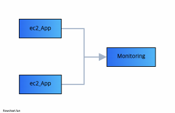
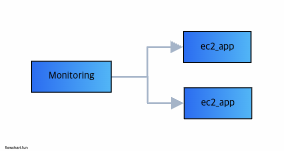
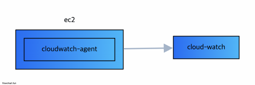

# Monitoring

## Metric 방식

> Push 방식



```ts
app.get('/', (req, res) => {
  // ... service login
  // ... send metric
})
```

> Pull 방식



```yml
global:
  scrape_interval: 15s
  evaluation_interval: 15s

  external_loables:
    monitor: 'my-project'

    targets: 'localhost:8000'
```

## Monitoring use CloudWatch-Agent

    - cloudwatch agent를 설치하여 해당 instnace의 대한 metric을 수집한다.
    - logging, metric 을 json 파일로 구성하여 cloud-watch로 사용할 수 있다



## Metric use Prometheus

    - 시간별로 변환하는 데이터(time-series data)를 저장하고 수집
    - 다차원 데이터를 다룬다. (use PromQL)
    - 자체 local, s3, remote storage 방식의 저장방식을 설정할 수 있음
    - push, pull 방식 모두 지원
